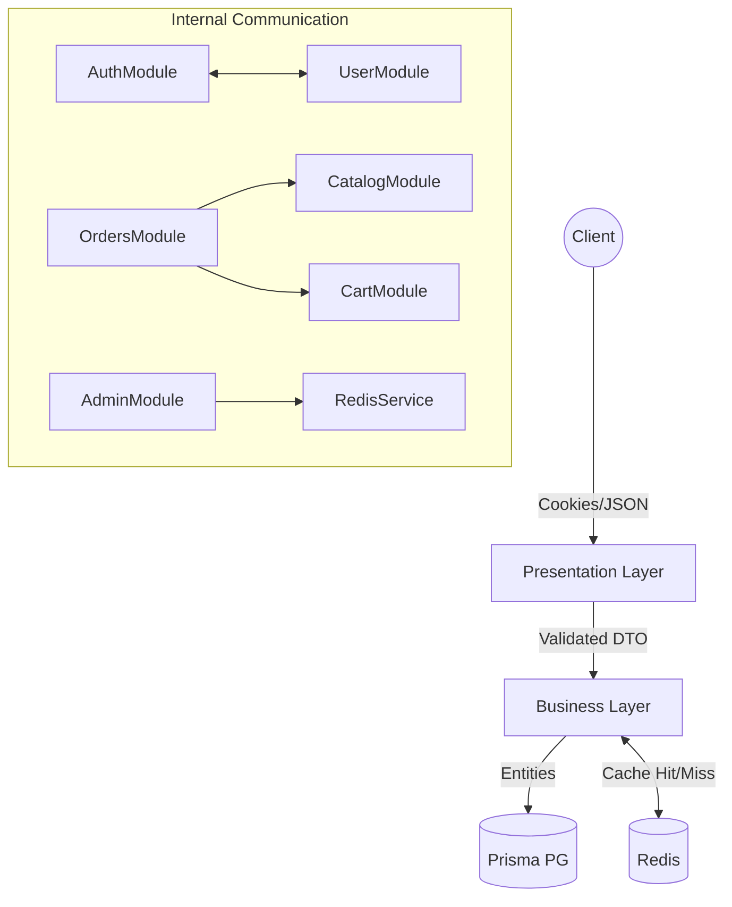

# NestJS Enterprise - Cẩm Nang Kiến Trúc Toàn Tập (The Ultimate Architectural Guide)

Tài liệu này cung cấp cái nhìn chi tiết nhất về kiến trúc hệ thống, các lựa chọn kỹ thuật và luồng dữ liệu của dự án. Đây là tài liệu tham khảo chính cho bất kỳ lập trình viên nào muốn hiểu sâu về cách hệ thống vận hành và tại sao nó lại được thiết kế như vậy.

---

## 1. Triết Lý Thiết Kế: Enterprise Modular Architecture

### TẠI SAO:
Dự án chọn kiến trúc **Modular** thay vì **Monolith** truyền thống (dù vẫn trong một repository) vì:
- **Khả năng mở rộng (Scalability)**: Mỗi chức năng (Admin, Catalog, Auth, Order) được đóng gói trong một module riêng. Khi một module phình to, ta có thể tách nó ra thành một Microservice mà không làm ảnh hưởng đến phần còn lại.
- **Tính đóng gói (Encapsulation)**: Các module chỉ chia sẻ những gì chúng explicit `exports`. Điều này ngăn chặn việc "spaghetti code" nơi mọi service gọi lẫn nhau một cách lộn xộn.
- **Dễ bảo trì và Test**: Việc cô lập logic giúp viết Unit Test chính xác hơn và giảm thiểu rủi ro lỗi lan truyền (Side effects).

---

## 2. Phân Tích Các Lớp Kiến Trúc (Architectural Layers)

### A. Infrastructure Layer (Prisma & Redis)
#### **Đây là gì?**
Lớp nền tảng quản lý kết nối với các hệ thống bên ngoài: PostgreSQL (qua Prisma) và Redis.

#### **Tại sao viết như vậy chứ không viết cách khác?**
- **Sử dụng Prisma Adapter cho PG Pool**: Thay vì dùng Prisma Client mặc định, chúng ta sử dụng `pg` pool với `PrismaPg` adapter. Cách này cho phép kiểm soát kết nối (connection pooling) tốt hơn, quan trọng trong môi trường Enterprise khi có hàng nghìn request đồng thời.
- **Redis làm Cache-Aside**: Không sử dụng cache mặc định của NestJS mà tự viết `RedisService`. Điều này cho phép chúng ta kiểm soát chính xác thời điểm xóa cache (invalidation) - ví dụ: xóa cache sản phẩm ngay khi Admin cập nhật giá.

#### **Data/logic đi vào từ đâu và đi ra đến đâu?**
- **Vào**: Các Service gọi `PrismaService` để truy vấn DB hoặc `RedisService` để lấy dữ liệu đệm.
- **Ra**: Trả về các Entity (Object từ DB) hoặc dữ liệu đã được cache.

#### **Nếu thay đổi phần này thì ảnh hưởng gì đến phần khác?**
- Thay đổi schema trong `schema.prisma` sẽ yêu cầu cập nhật lại các DTO và Logic trong Service.
- Nếu Redis gặp sự cố, hệ thống vẫn hoạt động nhưng tốc độ phản hồi sẽ chậm lại do mọi request đều phải xuống Database.

---

### B. Domain/Business Layer (Services)
#### **Đây là gì?**
Nơi chứa 100% "linh hồn" của ứng dụng. Mọi quy tắc nghiệp vụ như tính thuế, kiểm tra kho, xử lý thanh toán đều nằm ở đây.

#### **Tại sao viết như vậy chứ không viết cách khác?**
- **Service-Only Logic**: Controller tuyệt đối không chứa logic. Điều này giúp code Service có thể được tái sử dụng bởi nhiều Controller khác nhau (ví dụ: `AdminProductsService` có thể được gọi bởi cả `AdminModule` và `AnalyticsModule`).
- **Dependency Injection (DI)**: Sử dụng DI để tiêm các repository và service khác. Cách này giúp "Loose Coupling" (liên kết lỏng lẻo).

#### **Data/logic đi vào từ đâu và đi ra đến đâu?**
- **Vào**: Nhận dữ liệu đã được validate từ Controller thông qua các tham số hàm.
- **Ra**: Trả về dữ liệu thô (Raw Data) hoặc ném ra các Business Exception (ví dụ: `NotFoundException`, `ConflictException`).

#### **Nếu thay đổi phần này thì ảnh hưởng gì đến phần khác?**
- Đây là phần nhạy cảm nhất. Thay đổi logic tính toán ở đây sẽ ảnh hưởng trực tiếp đến kết quả trả về cho khách hàng và tính chính xác của dữ liệu trong DB.

---

### C. Presentation Layer (Controllers & DTOs)
#### **Đây là gì?**
Cổng tiếp nhận request từ thế giới bên ngoài.

#### **Tại sao viết như vậy chứ không viết cách khác?**
- **DTO (Data Transfer Objects)**: Sử dụng DTO với `class-validator` để đảm bảo dữ liệu "sạch" ngay từ cửa ngõ. Chúng ta không bao giờ dùng kiểu `any` cho request body.
- **Tách biệt Admin và Public API**: Các module được chia thành `admin/` và `catalog/`. Dù dùng chung dữ liệu nhưng Controller khác nhau giúp việc áp dụng Guard (phân quyền) trở nên cực kỳ đơn giản và an toàn.

#### **Data/logic đi vào từ đâu và đi ra đến đâu?**
- **Vào**: Request từ Client (JSON, Query Params, Cookies).
- **Ra**: Gọi Service và nhận kết quả, sau đó trả về cho Interceptor để format lại.

#### **Nếu thay đổi phần này thì ảnh hưởng gì đến phần khác?**
- Thay đổi đường dẫn `@Controller('path')` hoặc cấu trúc DTO sẽ làm hỏng kết nối với Frontend.

---

### D. Cross-cutting Concerns (Guards, Interceptors, Filters)
#### **Đây là gì?**
Các lớp bảo vệ và bổ trợ xuyên suốt toàn hệ thống.

#### **Tại sao viết như vậy chứ không viết cách khác?**
- **AuthGuard dựa trên Cookie**: Thay vì Header, chúng ta dùng Cookie `HttpOnly`. Tại sao? Vì nó chống lại tấn công XSS tốt hơn nhiều so với việc lưu token trong LocalStorage.
- **AllExceptionsFilter**: Một "Crisis Management Team" thực thụ. Thay vì để NestJS trả về lỗi mặc định, filter này bắt mọi lỗi và format lại theo chuẩn: `{ statusCode, message, timestamp, path }`. Điều này giúp Frontend luôn nhận được cấu trúc lỗi thống nhất.
- **TransformInterceptor**: Đảm bảo mọi response thành công đều có dạng `{ success: true, data: ... }`.

#### **Data/logic đi vào từ đâu và đi ra đến đâu?**
- **Vào**: Chặn đứng Request trước khi vào Controller (Guards) hoặc bao bọc Response sau khi rời khỏi Service (Interceptors).
- **Ra**: Hoặc là cho phép đi tiếp, hoặc là trả về lỗi ngay lập tức.

#### **Nếu thay đổi phần này thì ảnh hưởng gì đến phần khác?**
- Thay đổi `AuthGuard` có thể làm lộ thông tin nhạy cảm hoặc khóa toàn bộ người dùng ngoài hệ thống.

---

## 3. LOGIC: Vòng Đời Chi Tiết Của Một Request

Hãy tưởng tượng một request mua hàng:
1.  **Cookie Parser**: Tách token từ Cookie.
2.  **AuthGuard**: "Anh là ai?" - Kiểm tra token trong Redis/DB và gắn `user` vào request.
3.  **RolesGuard**: "Anh có quyền mua không?" - Kiểm tra Role.
4.  **ValidationPipe**: "Dữ liệu anh gửi lên có đúng định dạng không?" - Check DTO.
5.  **Controller**: "Đã rõ, mời anh vào phòng chờ." - Điều hướng sang Service.
6.  **Service**: "Hệ thống đang kiểm tra kho và tính tiền cho anh..." - Xử lý nghiệp vụ.
7.  **Prisma**: "Ghi nhận đơn hàng vào sổ cái (Database)."
8.  **TransformInterceptor**: "Đơn hàng của anh đây, tôi đã đóng gói đẹp đẽ rồi." - Bọc dữ liệu.
9.  **Client**: Nhận được JSON chuẩn chỉnh.

---

## 4. FLOW: Luồng Dữ Liệu Giữa Các Module

---

## 5. KẾT NỐI: Đồ Thị Phụ Thuộc (Dependency Graph)

- **Module Độc Lập**: `PrismaModule`, `RedisModule`, `ConfigModule` (Global).
- **Module Hạt Nhân**: `UserModule` và `AuthModule`. Hầu hết các module khác đều phụ thuộc vào hai module này để xác thực người dùng.
- **Module Nghiệp Vụ**: `OrdersModule` là module phức tạp nhất, nó "kết nối" (imports) `CatalogModule`, `CartModule` và `UserModule` để hoàn tất quy trình thanh toán.

**Lưu ý quan trọng**: Nếu bạn thay đổi `AuthService`, bạn đang tác động đến 90% hệ thống. Nếu bạn thay đổi `CatalogService`, bạn chỉ đang tác động đến giao diện xem hàng của khách.

---
*Tài liệu này được thiết kế để đảm bảo tính minh bạch và chuẩn mực Enterprise cho dự án NestJS Learning Dashboard.*
