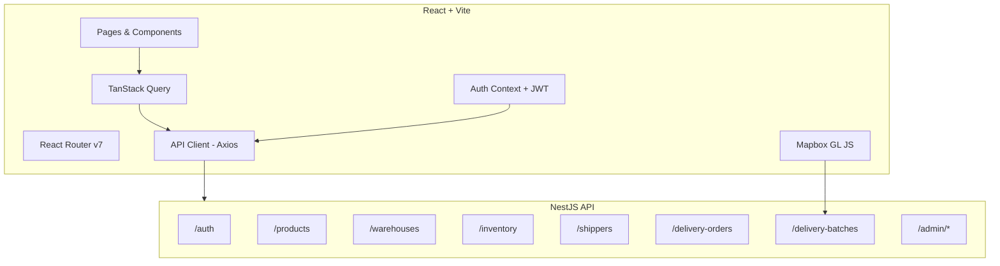

# Frontend Implementation Plan — Delivery Management Dashboard

> **Backend API:** 35 endpoints · 8 modules · JWT + Role-based auth (ADMIN, WAREHOUSE_MANAGER, SHIPPER)
> **Frontend Stack:** React 19 + Vite · TanStack Query · React Router · Mapbox GL JS · Recharts
> **Date:** 2026-06-14

---

## Architecture Overview



---

## Section 1: Project Setup & Infrastructure

**Goal:** Scaffolded React app with design system, API client, and routing skeleton.

### Task 1.1 — Initialize Vite + React Project
- `npx -y create-vite@latest ./frontend --template react`
- Install core deps: `react-router-dom`, `axios`, `@tanstack/react-query`, `@tanstack/react-query-devtools`
- Configure `vite.config.ts` with API proxy to `http://localhost:3000`

### Task 1.2 — Design System (CSS)
- Create `src/styles/` with:
  - `variables.css` — color palette (dark mode primary), spacing scale, typography tokens
  - `reset.css` — modern CSS reset
  - `components.css` — reusable component styles (buttons, inputs, cards, tables, badges, modals)
- Color palette: Dark background (`#0f1117`), card surface (`#1a1d27`), accent gradient (blue-violet `#6366f1` → `#8b5cf6`)
- Typography: Inter (Google Fonts)

### Task 1.3 — API Client Layer
- `src/lib/api.ts` — Axios instance with:
  - `baseURL: '/api'` (proxied by Vite)
  - Request interceptor: attach `Authorization: Bearer <token>` from localStorage
  - Response interceptor: 401 → redirect to login
- `src/lib/api/` — one file per module:
  - `auth.api.ts` — `login()`, `register()`
  - `products.api.ts` — `getAll()`, `getById()`, `create()`, `update()`, `remove()`
  - `warehouses.api.ts` — same CRUD pattern
  - `inventory.api.ts` — `importStock()`, `adjustStock()`, `getByWarehouse()`, `getByProduct()`, `getTransactions()`
  - `shippers.api.ts` — `getAll()`, `getAvailable()`, `getById()`, `create()`, `update()`
  - `delivery-orders.api.ts` — `create()`, `getAll(filters)`, `getById()`, `updateStatus()`, `assignShipper()`
  - `delivery-batches.api.ts` — `create()`, `getAll()`, `getById()`, `optimize()`, `start()`, `complete()`
  - `admin.api.ts` — `getSummary()`, `getTodaySummary()`, `getInventoryReport()`, `getShipperPerformance()`

### Task 1.4 — Routing Skeleton
```
/login                          → LoginPage
/                               → DashboardPage (redirect if not auth)
/products                       → ProductsPage
/warehouses                     → WarehousesPage
/warehouses/:id/stock           → WarehouseStockPage
/inventory/transactions         → TransactionLogPage
/shippers                       → ShippersPage
/delivery-orders                → DeliveryOrdersPage
/delivery-orders/new            → CreateOrderPage
/delivery-orders/:id            → OrderDetailPage
/delivery-batches               → DeliveryBatchesPage
/delivery-batches/:id           → BatchDetailPage (with map)
/reports/inventory              → InventoryReportPage
/reports/shippers               → ShipperPerformancePage
```

### Task 1.5 — Auth Context
- `src/contexts/AuthContext.tsx` — provides `user`, `login()`, `logout()`, `isAuthenticated`
- Decode JWT payload (`sub`, `role`) to determine current user role
- `<ProtectedRoute>` component: redirects to `/login` if no token
- `<RoleGate roles={[...]}>` component: hides/disables UI elements based on role

**Deliverable:** App runs at `localhost:5173`, shows login page, all routes defined but render placeholder pages.

---

## Section 2: Authentication & Layout Shell

**Goal:** Working login flow, persistent session, and the main app layout.

### Task 2.1 — Login Page
- Form: email + password fields
- Calls `POST /auth/login` → stores `accessToken` + `refreshToken` in localStorage
- Error state: "Email hoặc mật khẩu sai" toast
- Redirect to `/` on success
- Dark themed card, centered layout, gradient accent button

### Task 2.2 — App Layout (Shell)
- **Sidebar** (collapsible):
  - Logo/Brand
  - Nav links grouped by category:
    - 📊 Dashboard
    - 📦 Products
    - 🏭 Warehouses
    - 📋 Inventory Transactions
    - 🚚 Shippers
    - 📨 Delivery Orders
    - 🗂️ Delivery Batches
    - 📈 Reports (sub-menu: Inventory, Shippers)
  - Active link highlight with left accent bar
  - Role-based visibility: hide Reports for SHIPPER role
- **Header Bar**:
  - Breadcrumbs
  - User info badge (name, role)
  - Logout button
- **Content Area**: `<Outlet />` for nested routes

### Task 2.3 — Toast Notification System
- Lightweight toast component (success, error, warning, info)
- Context-based: `useToast()` hook
- Auto-dismiss with slide animation

**Deliverable:** User can log in → see sidebar → navigate between placeholder pages → log out.

---

## Section 3: Product Management

**Goal:** Full CRUD for products with search, filter, and modal forms.

### Task 3.1 — Products List Page
| API | `GET /products` |
|-----|-----------------|
| **Features** | Data table with columns: Name, SKU, Unit, Price, Status, Actions |
| **Search** | Client-side filter by name/SKU |
| **Actions** | Add (button), Edit (row action), Delete (row action, ADMIN only) |

### Task 3.2 — Create/Edit Product Modal
| API | `POST /products` / `PATCH /products/:id` |
|-----|------------------------------------------|
| **Form Fields** | name (required), sku (required), unit (required), price (required, decimal), description (optional) |
| **Validation** | Client-side: required fields, price ≥ 0, max decimal places = 2 |
| **UX** | Modal overlay with form, cancel/save buttons |

### Task 3.3 — Delete Product
| API | `DELETE /products/:id` |
|-----|------------------------|
| **Guard** | ADMIN role only — hide button for WAREHOUSE_MANAGER |
| **UX** | Confirmation dialog before delete, optimistic UI update |

**Deliverable:** Full product CRUD working. Table shows live data. Modals for add/edit.

---

## Section 4: Warehouse & Inventory Management

**Goal:** Warehouse CRUD + stock overview + import/adjust stock + transaction log.

### Task 4.1 — Warehouses List Page
| API | `GET /warehouses` |
|-----|-------------------|
| **Columns** | Name, Address, Lat/Lng (if available), Status, Actions |
| **Actions** | Add, Edit, Delete (ADMIN), View Stock (link to `/warehouses/:id/stock`) |

### Task 4.2 — Create/Edit Warehouse Modal
| API | `POST /warehouses` / `PATCH /warehouses/:id` |
|-----|----------------------------------------------|
| **Form Fields** | name, address, lat (optional), lng (optional) |

### Task 4.3 — Warehouse Stock Page
| API | `GET /inventory/warehouse/:warehouseId` |
|-----|----------------------------------------|
| **View** | Table: Product Name, SKU, Current Quantity, Unit |
| **Actions** | "Import Stock" button, "Adjust Stock" button (per row) |
| **Header** | Warehouse name + address |

### Task 4.4 — Import Stock Modal
| API | `POST /inventory/import` |
|-----|--------------------------|
| **Form** | Warehouse (pre-selected from context), Product (dropdown from `GET /products`), Quantity (≥1), Reason (optional), Reference ID (optional PO number) |
| **On Success** | Invalidate stock query, show success toast |

### Task 4.5 — Adjust Stock Modal
| API | `POST /inventory/adjust` |
|-----|--------------------------|
| **Form** | Warehouse (pre-selected), Product (pre-selected from row), Quantity (integer, + or -), Reason (required for adjustments) |

### Task 4.6 — Inventory Transaction Log Page
| API | `GET /inventory/transactions?warehouseId=&productId=&type=&take=&skip=` |
|-----|------------------------------------------------------------------------|
| **Columns** | Date, Warehouse, Product, Type (badge: IMPORT/EXPORT/ADJUSTMENT/RETURN), Qty, Balance Before → After, Reason, Created By |
| **Filters** | Warehouse dropdown, Product dropdown, Type dropdown, pagination (take/skip) |
| **UX** | Color-coded badges for transaction types. Positive qty = green, negative = red |

**Deliverable:** Warehouse management + stock visibility + import/adjust workflows + audit trail.

---

## Section 5: Shipper Management

**Goal:** Manage shippers with status tracking.

### Task 5.1 — Shippers List Page
| API | `GET /shippers` |
|-----|-----------------|
| **Columns** | User Name, Phone, Vehicle Type, Available (badge), Actions |
| **Quick Filter** | Toggle to show only available shippers (`GET /shippers/available`) |

### Task 5.2 — Create Shipper Modal
| API | `POST /shippers` |
|-----|------------------|
| **Form** | userId (dropdown of users with SHIPPER role — may need a users endpoint or manual input), phone, vehicleType (optional) |
| **Note** | The backend requires linking to an existing User with SHIPPER role. UI should make this clear. |

### Task 5.3 — Update Shipper Modal
| API | `PATCH /shippers/:id` |
|-----|------------------------|
| **Form** | phone, vehicleType, isAvailable (toggle switch) |

**Deliverable:** Shipper list with availability status, create/update.

---

## Section 6: Delivery Orders (Core Feature)

**Goal:** Create orders with item lines, manage statuses, assign shippers.

### Task 6.1 — Orders List Page
| API | `GET /delivery-orders?status=&shipperId=&warehouseId=` |
|-----|------------------------------------------------------|
| **Columns** | ID, Recipient, Address, Warehouse, Shipper, Status (badge), Created, Actions |
| **Filters** | Status dropdown (PENDING/ASSIGNED/PICKED_UP/IN_TRANSIT/DELIVERED/FAILED/CANCELLED), Warehouse, Shipper |
| **Status Badges** | Color-coded: PENDING=yellow, ASSIGNED=blue, IN_TRANSIT=orange, DELIVERED=green, FAILED=red, CANCELLED=gray |

### Task 6.2 — Create Order Page (`/delivery-orders/new`)
| API | `POST /delivery-orders` |
|-----|-------------------------|
| **Form Sections** | |
| **Recipient Info** | recipientName, recipientPhone |
| **Delivery Address** | address (text input — backend geocodes via Mapbox) |
| **Warehouse** | Dropdown from `GET /warehouses` |
| **Assign Shipper** | Optional dropdown from `GET /shippers/available` |
| **Order Items** | Dynamic list: Product (dropdown) + Quantity. Add/remove rows. Min 1 item. |
| **Notes** | Optional textarea |
| **UX** | Multi-step or single-page form with clear sections |

### Task 6.3 — Order Detail Page (`/delivery-orders/:id`)
| API | `GET /delivery-orders/:id` |
|-----|----------------------------|
| **Display** | Full order info: recipient, address (with lat/lng map pin if geocoded), warehouse, shipper, status timeline, items table |
| **Actions** | Update Status (dropdown), Assign Shipper (if PENDING) |
| **Map** | If lat/lng exists, show a small Mapbox map with delivery pin |

### Task 6.4 — Status Update Action
| API | `PATCH /delivery-orders/:id/status` |
|-----|-------------------------------------|
| **UI** | Dropdown or button group for valid next statuses |
| **Validation** | Frontend should guide valid transitions (e.g., PENDING → ASSIGNED → PICKED_UP → IN_TRANSIT → DELIVERED) |

### Task 6.5 — Assign Shipper Action
| API | `PATCH /delivery-orders/:id/assign/:shipperId` |
|-----|------------------------------------------------|
| **UI** | Modal with available shippers dropdown |

**Deliverable:** Full order lifecycle — create with items, list with filters, view detail, update status, assign shipper.

---

## Section 7: Delivery Batches & Route Optimization (Highest Complexity)

**Goal:** Batch multiple orders, optimize routes via Mapbox, visualize on map.

### Task 7.1 — Batches List Page
| API | `GET /delivery-batches?shipperId=` |
|-----|-------------------------------------|
| **Columns** | ID, Shipper, Status (badge), Orders count, Total Distance (km), Est. Duration, Created |
| **Status Badges** | PLANNING=gray, OPTIMIZED=blue, IN_PROGRESS=orange, COMPLETED=green, CANCELLED=red |
| **Filter** | By shipper |

### Task 7.2 — Create Batch Flow
| API | `POST /delivery-batches` |
|-----|--------------------------|
| **Step 1** | Select a shipper from available shippers (`GET /shippers/available`) |
| **Step 2** | Select orders to batch: show PENDING/ASSIGNED orders list with checkboxes (min 2 orders). Filter by warehouse. |
| **Step 3** | Review selection → Submit |
| **Backend** | Auto-assigns shipper to selected orders + auto-runs Mapbox route optimization |
| **UX** | Multi-step wizard with clear progress indicator |

### Task 7.3 — Batch Detail Page with Map (`/delivery-batches/:id`) ⭐
| API | `GET /delivery-batches/:id` |
|-----|------------------------------|
| **Info Panel** | Shipper name, status, total distance (km), estimated duration (formatted), created/started/completed timestamps |
| **Orders Table** | Sequence Order, Recipient, Address, Status — sorted by `sequenceOrder` |
| **Route Map** | Mapbox GL JS map showing: |
|  | — Warehouse marker (start point) |
|  | — Numbered markers for each delivery stop (in optimized sequence) |
|  | — Polyline connecting all stops (decoded from `optimizedRoute.geometry`) |
|  | — Fit bounds to show full route |
| **Actions** | |
| **Re-Optimize** | `PATCH /delivery-batches/:id/optimize` — button to recalculate route |
| **Start Batch** | `PATCH /delivery-batches/:id/start` — available when status = OPTIMIZED |
| **Complete Batch** | `PATCH /delivery-batches/:id/complete` — available when status = IN_PROGRESS |

### Task 7.4 — Mapbox GL JS Integration
- Install `mapbox-gl` + `@types/mapbox-gl`
- Create `src/components/Map/RouteMap.tsx`:
  - Props: `warehouseCoords`, `stops: {lat, lng, label, sequence}[]`, `routeGeometry?: string`
  - Render Mapbox map with dark style (`mapbox://styles/mapbox/dark-v11`)
  - Custom markers: warehouse icon, numbered delivery markers
  - Decode polyline geometry → GeoJSON LineString → add as source/layer
  - Auto `fitBounds` to include all points
- Create `src/components/Map/PinMap.tsx` (simpler, for order detail — single pin)

**Deliverable:** Batch creation wizard, optimized route visualization on map, batch lifecycle actions.

---

## Section 8: Admin Dashboard & Reports

**Goal:** Summary dashboard with real-time stats and detailed reports.

### Task 8.1 — Dashboard Page (`/`)
| APIs | `GET /admin/dashboard/summary` + `GET /admin/dashboard/today` |
|------|---------------------------------------------------------------|
| **Summary Cards** (top row) | Total Orders, Pending Orders, In-Transit, Delivered, Total Batches, Active Batches, Total Products, Available Shippers |
| **Today Section** | Orders Today, Delivered Today, Batches Today |
| **Card Style** | Glassmorphism cards with icon, number (large), label, subtle gradient border |
| **UX** | Auto-refresh every 30s using TanStack Query `refetchInterval` |

### Task 8.2 — Inventory Reconciliation Report
| API | `GET /admin/reports/inventory/:warehouseId` |
|-----|----------------------------------------------|
| **Select** | Warehouse dropdown at top |
| **Table** | Product, Total Import, Total Export, Total Adjustment, Total Return, Expected Balance, Current Stock, **Discrepancy** (highlighted red if nonzero) |
| **Chart** | Bar chart (Recharts) comparing expected vs actual stock per product |

### Task 8.3 — Shipper Performance Report
| API | `GET /admin/reports/shippers?startDate=&endDate=` |
|-----|---------------------------------------------------|
| **Filters** | Date range picker (start, end) |
| **Table** | Shipper Name, Total Batches, Completed Batches, Total Orders, Total Distance (km) |
| **Charts** | |
| | — Bar chart: orders per shipper |
| | — Horizontal bar: distance covered per shipper |
| **Calculation** | Completion rate = completedBatches / totalBatches x 100% |

**Deliverable:** Live dashboard with auto-refresh, inventory audit report with chart, shipper KPI report with charts.

---

## Implementation Order & Dependencies

```mermaid
gantt
    title Frontend Implementation Timeline
    dateFormat  YYYY-MM-DD
    axisFormat  %d %b

    section Foundation
    S1: Project Setup & Infra         :s1, 2026-06-15, 2d
    S2: Auth & Layout Shell           :s2, after s1, 1d

    section CRUD Modules
    S3: Product Management            :s3, after s2, 1d
    S4: Warehouse & Inventory         :s4, after s2, 2d
    S5: Shipper Management            :s5, after s2, 1d

    section Core Features
    S6: Delivery Orders               :s6, after s3 s4 s5, 2d
    S7: Batches & Route Map           :crit, s7, after s6, 3d

    section Intelligence
    S8: Dashboard & Reports           :s8, after s2, 2d
```

| Priority | Section | Effort | Dependencies |
|----------|---------|--------|--------------|
| 🔴 P0 | S1 — Setup & Infra | 2 days | None |
| 🔴 P0 | S2 — Auth & Layout | 1 day | S1 |
| 🟡 P1 | S3 — Products | 1 day | S2 |
| 🟡 P1 | S4 — Warehouses & Inventory | 2 days | S2 |
| 🟡 P1 | S5 — Shippers | 1 day | S2 |
| 🔴 P0 | S6 — Delivery Orders | 2 days | S3, S4, S5 (needs product/warehouse/shipper dropdowns) |
| 🔴 P0 | S7 — Batches & Route Map | 3 days | S6 |
| 🟡 P1 | S8 — Dashboard & Reports | 2 days | S2 (can parallel with S3-S5) |

**Total estimated effort: ~12–14 days**

---

## API-to-Frontend Mapping (Complete)

| Backend Endpoint | Frontend Location | UI Element |
|---|---|---|
| `POST /auth/login` | LoginPage | Login form |
| `POST /auth/register` | — | Not exposed (admin creates users) |
| `GET /products` | ProductsPage | Data table |
| `POST /products` | ProductsPage | Create modal |
| `PATCH /products/:id` | ProductsPage | Edit modal |
| `DELETE /products/:id` | ProductsPage | Delete confirmation |
| `GET /warehouses` | WarehousesPage | Data table + dropdowns everywhere |
| `POST /warehouses` | WarehousesPage | Create modal |
| `PATCH /warehouses/:id` | WarehousesPage | Edit modal |
| `DELETE /warehouses/:id` | WarehousesPage | Delete confirmation |
| `GET /inventory/warehouse/:id` | WarehouseStockPage | Stock table |
| `GET /inventory/product/:id` | WarehouseStockPage | (cross-reference) |
| `POST /inventory/import` | WarehouseStockPage | Import modal |
| `POST /inventory/adjust` | WarehouseStockPage | Adjust modal |
| `GET /inventory/transactions` | TransactionLogPage | Paginated table with filters |
| `GET /shippers` | ShippersPage | Data table |
| `GET /shippers/available` | ShippersPage, CreateBatch, AssignShipper | Filtered list / dropdown |
| `POST /shippers` | ShippersPage | Create modal |
| `PATCH /shippers/:id` | ShippersPage | Edit modal |
| `POST /delivery-orders` | CreateOrderPage | Multi-section form |
| `GET /delivery-orders` | DeliveryOrdersPage | Filtered data table |
| `GET /delivery-orders/:id` | OrderDetailPage | Detail view + map |
| `PATCH /delivery-orders/:id/status` | OrderDetailPage | Status update action |
| `PATCH /delivery-orders/:id/assign/:shipperId` | OrderDetailPage | Assign shipper modal |
| `POST /delivery-batches` | CreateBatch wizard | Multi-step wizard |
| `GET /delivery-batches` | DeliveryBatchesPage | Data table |
| `GET /delivery-batches/:id` | BatchDetailPage | Detail + route map |
| `PATCH /delivery-batches/:id/optimize` | BatchDetailPage | Re-optimize button |
| `PATCH /delivery-batches/:id/start` | BatchDetailPage | Start button |
| `PATCH /delivery-batches/:id/complete` | BatchDetailPage | Complete button |
| `GET /admin/dashboard/summary` | DashboardPage | Summary cards |
| `GET /admin/dashboard/today` | DashboardPage | Today stats |
| `GET /admin/reports/inventory/:id` | InventoryReportPage | Table + bar chart |
| `GET /admin/reports/shippers` | ShipperPerformancePage | Table + charts |

---

## Shared Components Inventory

| Component | Used By | Description |
|-----------|---------|-------------|
| `<DataTable>` | All list pages | Sortable, filterable table with actions column |
| `<Modal>` | All CRUD pages | Overlay dialog for create/edit forms |
| `<ConfirmDialog>` | Delete actions | "Are you sure?" confirmation |
| `<Badge>` | Orders, Batches, Transactions | Color-coded status/type labels |
| `<FormField>` | All forms | Label + input + error message wrapper |
| `<Select>` | Filters, forms | Dropdown with search capability |
| `<RouteMap>` | BatchDetailPage | Mapbox route visualization |
| `<PinMap>` | OrderDetailPage | Single-point Mapbox map |
| `<StatCard>` | DashboardPage | Metric card with icon + value |
| `<DateRangePicker>` | Reports | Start/end date selection |
| `<Sidebar>` | Layout | Collapsible navigation |
| `<Breadcrumbs>` | Layout | Path-based breadcrumbs |
| `<Toast>` | Global | Notification system |
| `<RoleGate>` | Throughout | Conditional render based on user role |
| `<EmptyState>` | All list pages | Friendly "no data" placeholder |
| `<LoadingSpinner>` | All async pages | Skeleton/spinner for loading states |

---

## Tech Decisions

| Decision | Choice | Rationale |
|----------|--------|-----------|
| Framework | React 19 + Vite | Fast dev server, lightweight, matches team skills |
| Routing | React Router v7 | File-based feel with `createBrowserRouter` |
| Data Fetching | TanStack Query v5 | Auto-cache, refetch, optimistic updates, devtools |
| HTTP Client | Axios | Interceptors for JWT, clean API layer |
| Styling | Vanilla CSS (Dark Mode) | Full control, no build dependency, matches GEMINI.md |
| Maps | Mapbox GL JS | Backend already uses Mapbox (geocoding + optimization). Reuse same token. |
| Charts | Recharts | Lightweight, React-native, good for bar/line charts |
| Forms | Controlled components | Simple enough for this scope, no need for Formik/RHF |
| State | React Context (Auth) + TanStack Query (server) | No Redux needed — server state via Query, minimal client state |
