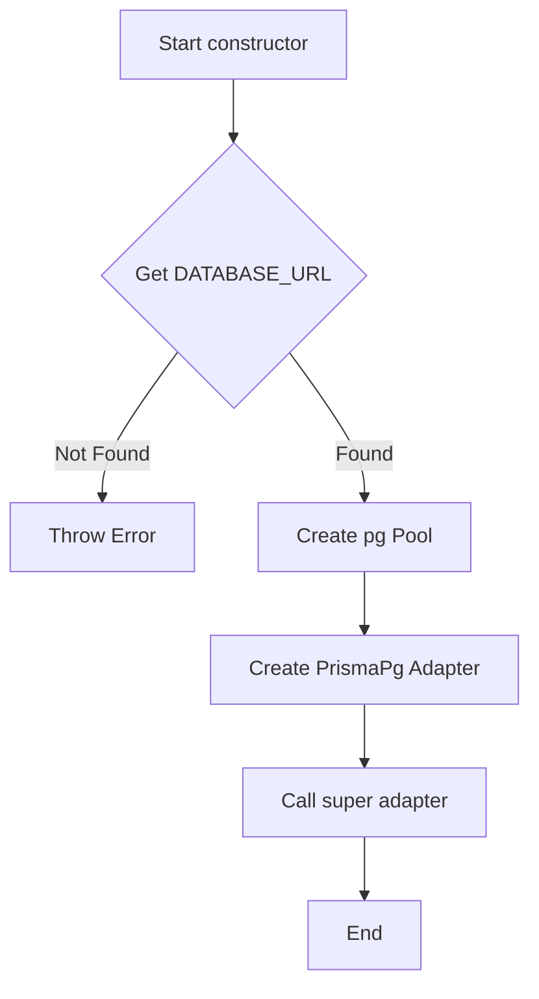
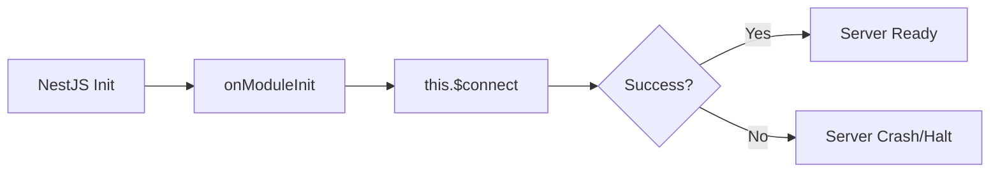

# Design Spec: Prisma Documentation Update

## 1. Goal
Update `docs/html/prisma.html` based on `docs/explanations/prisma.md` and `src/prisma/prisma.service.ts` to provide a comprehensive, visual, and technically accurate guide for the `PrismaService`.

## 2. Content Strategy
- **Service Breakdown**: Document `constructor` and `onModuleInit` using the "IN/OUT/Internal/Side Effects" template.
- **Visuals**:
    - Mermaid diagram for `constructor` (Adapter & Pool logic).
    - Mermaid diagram for `onModuleInit` (Lifecycle & Eager connection).
    - Update interactive lifecycle panel.
- **Styling**: Maintain VSCode Dark Theme.
- **Language**: Vietnamese (matching existing docs).

## 3. Detailed Method Specification

### 3.1. `constructor`
- **Purpose**: Initialize Prisma with `pg` Driver Adapter for high-performance pooling.
- **IN**: `ConfigService` (specifically `DATABASE_URL`).
- **OUT**: `PrismaService` instance.
- **Internal Calls**:
    - `configService.get<string>('DATABASE_URL')`
    - `new Pool({ connectionString })`
    - `new PrismaPg(pool)`
    - `super({ adapter })`
- **Side Effects**: Throws `InternalServerErrorException` if `DATABASE_URL` is missing.

### 3.2. `onModuleInit`
- **Purpose**: Trigger eager connection to PostgreSQL.
- **IN**: N/A.
- **OUT**: `Promise<void>`.
- **Internal Calls**: `this.$connect()`.
- **Side Effects**: Establishes physical connection; prevents app startup if DB is unreachable.

## 4. Visual Components

### 4.1. Mermaid: Constructor Logic

### 4.2. Mermaid: Connection Lifecycle

## 5. Technical Implementation
- Use `mermaid.js` library for rendering.
- Update `prisma.html` using `write_file` (no placeholders).
- Ensure syntax highlighting classes (`kw`, `fn`, `typ`, `prop`, etc.) are applied correctly.
